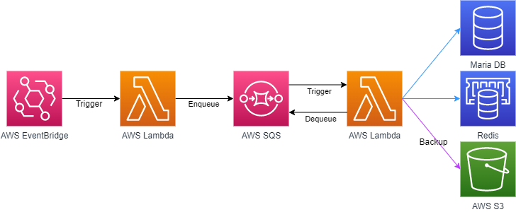

# Project Backup Lambda

All files in users' projects are stored in Redis by [IDE-server](https://github.com/Together-Coding/IDE-Server).
When Redis runs out of memory, there will be eviction and the stored data could be deleted.

To prevent this situation, **Project-Backup-Lambda** periodically picks out projects that are not recently accessed but have active flags, and then migrates them from Redis to AWS S3.

## How it works

- AWS EventBridge triggers `select_project` Lambda function every 30 minutes. It enqueues the project IDs that should be processed to AWS SQS.  
- AWS SQS triggers `backup_project` Lambda function for each message.

## What it does

### Selection

1. Query `user_projects` table to select the projects that are not accessed for 10 minutes but have active flags.
2. For each project queried, send its ID to AWS SQS.

### Backup

For each project from AWS SQS, the following processes are done:

1. Get a file list of the project from Redis.
2. Iterating the list, get file contents from Redis, and save the contents onto temporary directory.
3. Compress the directory.
4. Upload the compressed one to AWS S3.
5. Remove the data from Redis.
6. Set its flag as inactive.

## Requirements

- Node.js v14
- Python 3.9+

## Development

1. Install [serverless](https://www.serverless.com/) framework and a plugin.  
    `$ npm i serverless && sls plugin install -n serverless-python-requirements`
2. Copy a config file and modify it for you.  
    `$ cp configs.yml.example configs.yml`
3. To run functions, just use python.  
    `$ python handler.py`

## Deployment

1. Configure AWS credentials. Check out [here](https://boto3.amazonaws.com/v1/documentation/api/latest/guide/credentials.html) to see how to do that.
2. Deploy with serverless:  
    `$ sls deploy`
